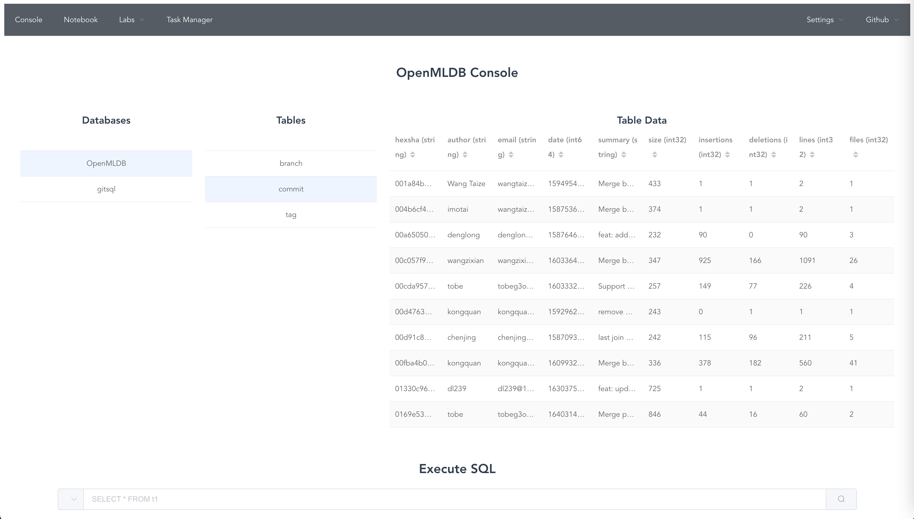
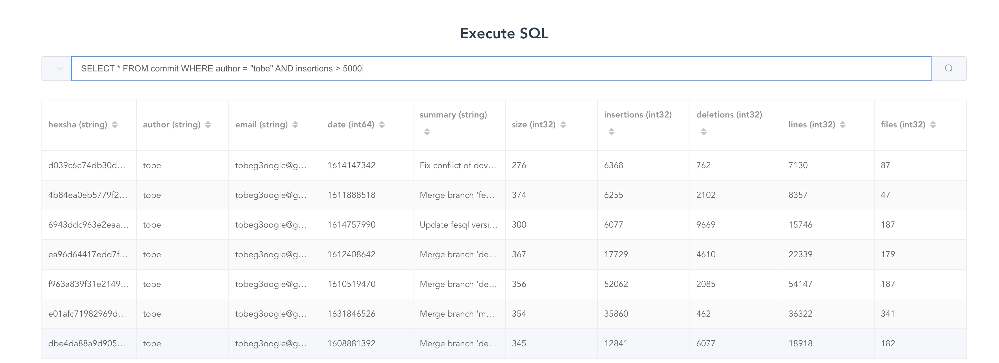
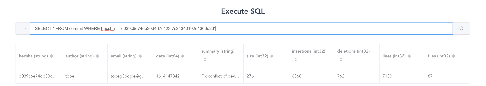
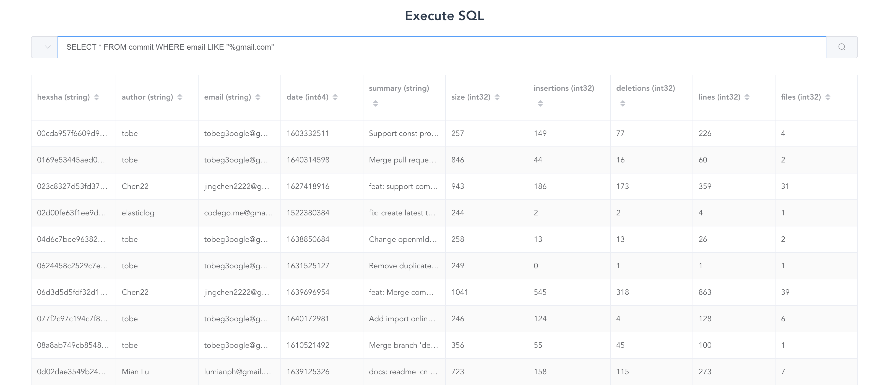

# gitsql

## Introduction 

This is the project which helps to query Git info with SQL.

By default, it uses [OpenMLDB](https://github.com/4paradigm/openmldb) to store data and visualize with [OpenMLDB LAB](https://github.com/tobegit3hub/openmldb_lab). 

## Install

```
pip install gitsql
```

## Usage

Initialize the database for git repository.

```
gitsql --repo ./gitsql init
```

Load the git data to database.

```
gitsql --repo ./gitsql load
```

Delete the database of the git repository.

```
gitsql --repo ./gitsql delete
```

Then we can use [openmldb_lab](https://github.com/tobegit3hub/openmldb_lab) to query with SQL in web browser.

```
pip install openmldb_lab

openmldb_lab --zk=0.0.0.0:2181 --zk_path=/openmldb
```



## Use Cases

### Query Large Insertions Commits

```
SELECT * FROM commit WHERE author = "tobe" AND insertions > 5000
```



### Query Specified Commit

```
SELECT * FROM commit WHERE hexsha = "d039c6e74db30d4d7c423f7c24340192e1306d23"
```



### Query Developers with Specified Email

```
SELECT * FROM commit WHERE email LIKE "%gmail.com"
```


